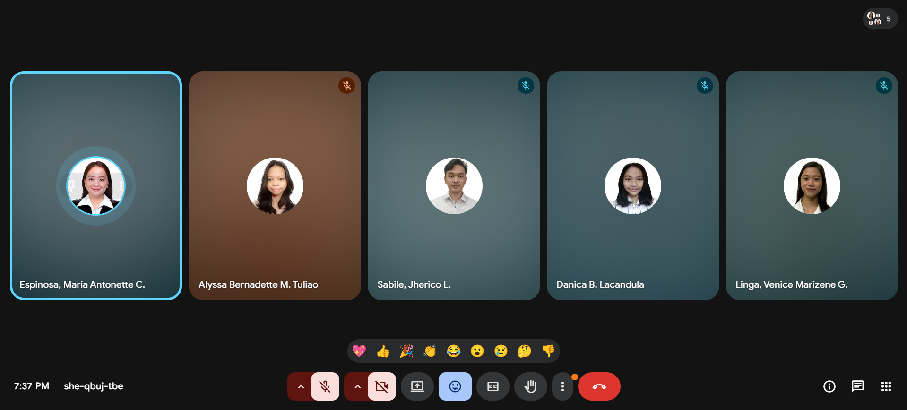

## CONSULTATION MEETING
**Date:** April 15, 2026

**Attendees:**
- Espinosa, Maria Antonette (Project Manager)
- Lacandula, Danica (UI/UX Developer)
- Tuliao, Alyssa Bernadette (Database Engineer)
- Sabile, Jherico (Rights Specialist)
- Linga, Venice Marizene (QA Specialist)

**Agenda:**
- Discussed the goals for Sprint 2 and the members' tasks
- Officially started the Sprint 2
- Dissemination of the Sprint 2 document created by the Project manager, which includes the tasks, guides, blockers, and prerequisites of other tasks.

---

