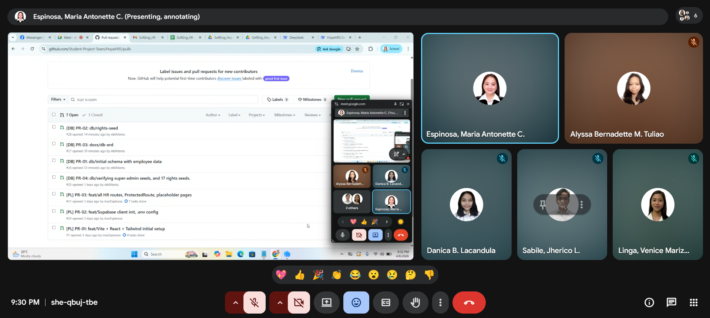

## STANDUP MEETING
**Date:** April 8, 2026

**Attendees:**
- Espinosa, Maria Antonette (Project Manager)
- Lacandula, Danica (UI/UX Developer)
- Tuliao, Alyssa Bernadette (Database Engineer)
- Sabile, Jherico (Rights Specialist)
- Linga, Venice Marizene (QA Specialist)

**Agendas:**
- Checks members’ progress and completion for Sprint 1.
- Deadline of the sprint 1.
- Goals for sprint 2:
  - Start of Sprint 2
  - CRUD
  - Discuss members’ tasks for Sprint 2
  - Tackles documentation requirements for every sprint

---

**Maria Antonette Espinosa - Project Manager**
- **Did last week:** Routing and placeholder images, coordination with the members, and reviewing pull requests
- **Doing this week:** Start creating Employee and Job History API services
- **Blockers:** Waiting for the completion of Sprint 1

**Danica Lacandula - UI/UX Developer**
- **Did last week:** AppShell and callback page
- **Doing this week:** Build Employee module UI
- **Blockers:** Sidebar links not updating based on auth state

**Alyssa Bernadette Tuliao - Database Engineer**
- **Did last week:** Migration of files and ERD
- **Doing this week:** Write RLS policies for employee table
- **Blockers:** Migration file issues and SQL statement problems

**Jherico Sabile - Rights and Authentication Specialist**
- **Did last week:** Login Guard and provision trigger
- **Doing this week:** Create UserRightsContext and useRights hook
- **Blockers:** Pull requests by UI/UX developer

**Venice Marizene Linga - QA and Documentation Specialist**
- **Did last week:** Sprint log and README
- **Doing this week:** Create a spreadsheet, Rights matrix testing
- **Blockers:** Pull requests by other four members

---

