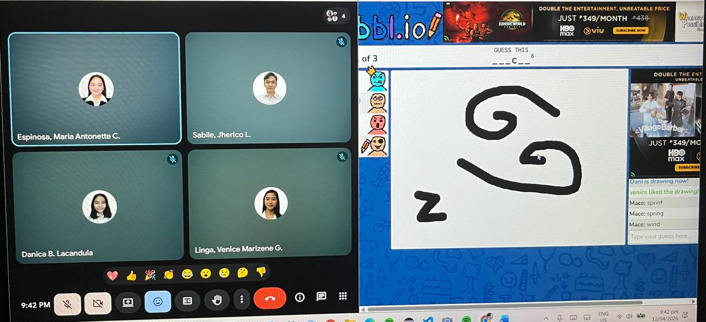

## STANDUP MEETING
**Date:** April 12, 2026

**Attendees:**
- Espinosa, Maria Antonette (Project Manager)
- Lacandula, Danica (UI/UX Developer)
- Sabile, Jherico (Rights Specialist)
- Linga, Venice Marizene (QA Specialist)

**Agendas:**
- Checked the members' progress and completion of tasks
- Each member reported the tasks they completed for the week
- Played a short game hosted by the Project Manager

---

**Maria Antonette Espinosa - Project Manager**
- **Did last week:** Routing and placeholder images, coordination with the members, and reviewing pull requests
- **Doing this week:** None because Sprint 1 is not yet fully completed.
- **Blockers:** None

**Danica Lacandula - UI/UX Developer**
- **Did last week:** AppShell and callback page, UI/UX documentation 
- **Doing this week:** None because Sprint 1 is not yet fully completed.
- **Blockers:** None

**Alyssa Bernadette Tuliao - Database Engineer**
- **Did last week:** Migration of files and ERD
- **Doing this week:** None because Sprint 1 is not yet fully completed.
- **Blockers:** None

**Jherico Sabile - Rights and Authentication Specialist**
- **Did last week:** Auth context, email auth, Google OAuth
- **Doing this week:** Login Guard and provision trigger
- **Blockers:**
    - Minor revisions for every PR
    - Email verification flow not triggering
    - Database webhook not firing on user creation

**Venice Marizene Linga - QA and Documentation Specialist**
- **Did last week:** Reviewing of pull requests, meeting documentations
- **Doing this week:** Reviewing of pull requests, meeting documentations, draft for Sprint log and README files
- **Blockers:** Awaiting PR approval from Rights Specialist before proceeding with QA testing

---

