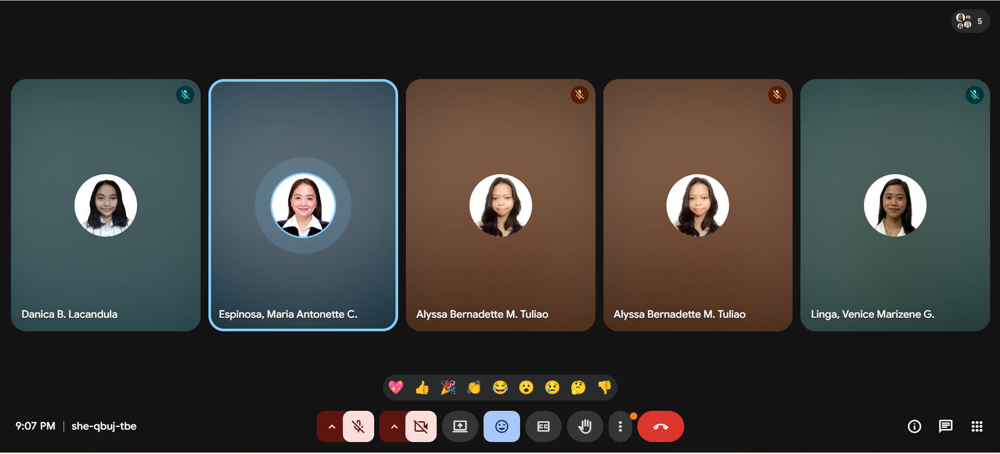

## STANDUP MEETING
**Date:** April 20, 2026

**Attendees:**
- Espinosa, Maria Antonette (Project Manager)
- Lacandula, Danica (UI/UX Developer)
- Tuliao, Alyssa Bernadette
- Linga, Venice Marizene (QA Specialist)

**Agendas:**
- Sprint 1 fully completed
- Sprint 2 tasks without prerequisites can start, but Scrum Manager has not started with her tasks.

